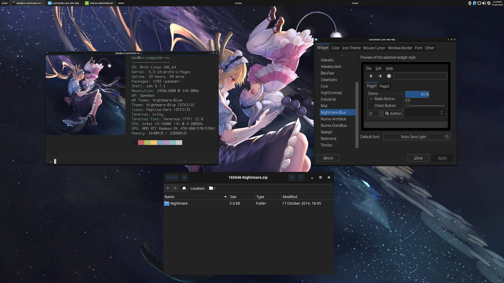

# Nightmare-Blue-GTK
A GTK 2/3 theme based off of maxim2's [Openbox theme](https://www.box-look.org/p/1017737/).
# Screenshot

# Install
### Theme
- Run `mkdir -p ~/.themes`
- Copy `Nightmare-Blue` to `~/.themes/`
### Font
- Run `mkdir -p ~/.fonts/TTF/`
- Copy `fonts/pf_arma_five.ttf` to `~/.fonts/TTF/`
### Panel
- Run `mkdir -p ~/.tint2`
- Copy `tint2rc` to `~/.tint2`
### Icons
- I suggest [Papirus-Dark](https://github.com/PapirusDevelopmentTeam/papirus-icon-theme).
